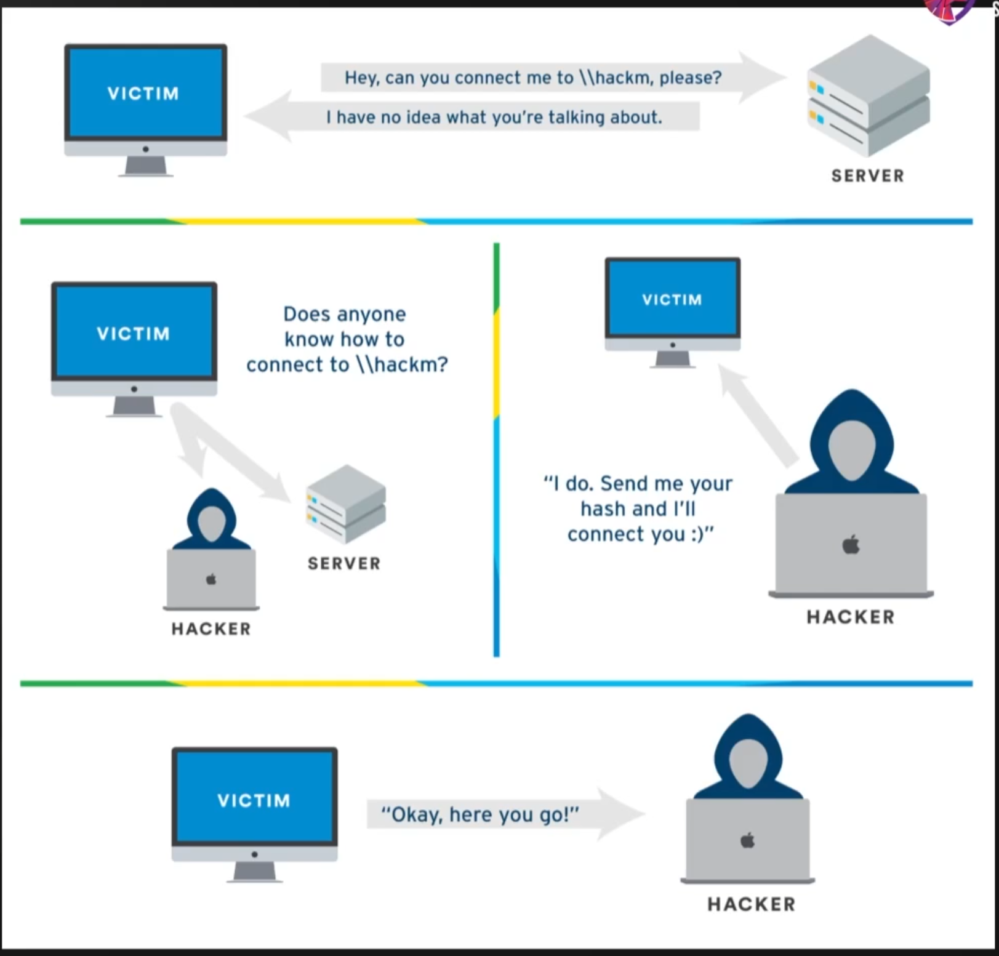

# LLMNR Poisoning

Link-local multicast name resolution - Most common attack

Good to use when lots of traffic

Used to identify hosts when DNS fails to do so

Previously NBT-NS

The key flaw is that the services utilize a user's username and NTLMv2 hash appropriately

Intercept traffic - able to get username and hash

Man-In-The-Middle attack

<figure><figcaption></figcaption></figure>

Responder

sudo responder -I tun0 -dw -- Can not use dwP as only one switch can be used

<figure><figcaption></figcaption></figure>

hashcat --help | grep NTLM



hashcat -m 5600 hash.txt /wordlist/location use --force if not working in VM/ -0 increase speed of cracking

rockyou2021 - 91 gb of passwords

Can take several hours to crack

use rule sets in IRL and not so much in CTFs

hashcat -m 5600 hash.txt /wordlist/location -r OneRule
