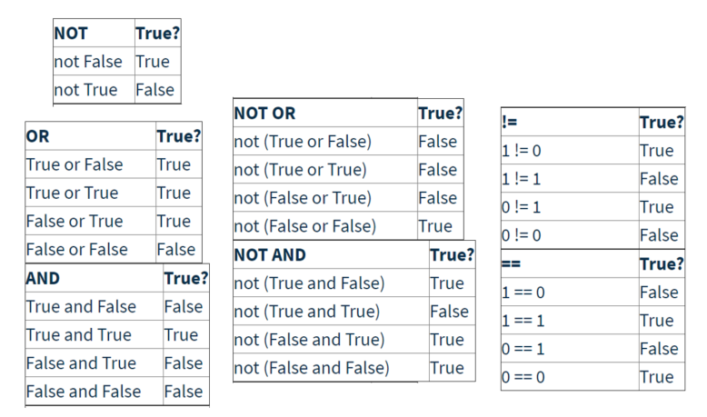

# Boolean and Relational Operators

Boolean expressions - True or False

bool1 = True

bool2 = 3\*3 == 9 #variable bool2 does not equal 9 its saying 3\*3 is the function and it equals 9

bool3 = False

bool4 = 3\*3 !=9

print(type(bool1)) #tells us what type

bool5 = "True"

print(type(bool5)) #is a string

\#Relational and boolean operators

greater\_than = 7 > 5

&#x20;less\_than = 5 < 7&#x20;

greater\_than\_equal\_to = 7 >=7&#x20;

less\_than\_equal\_to = 7 <= 7

test\_and = True and True #True&#x20;

test\_and2 = True and False #False&#x20;

test\_or = True or True #True&#x20;

test\_or2 = True or False #True

test\_not = not True #False

<figure><figcaption></figcaption></figure>

